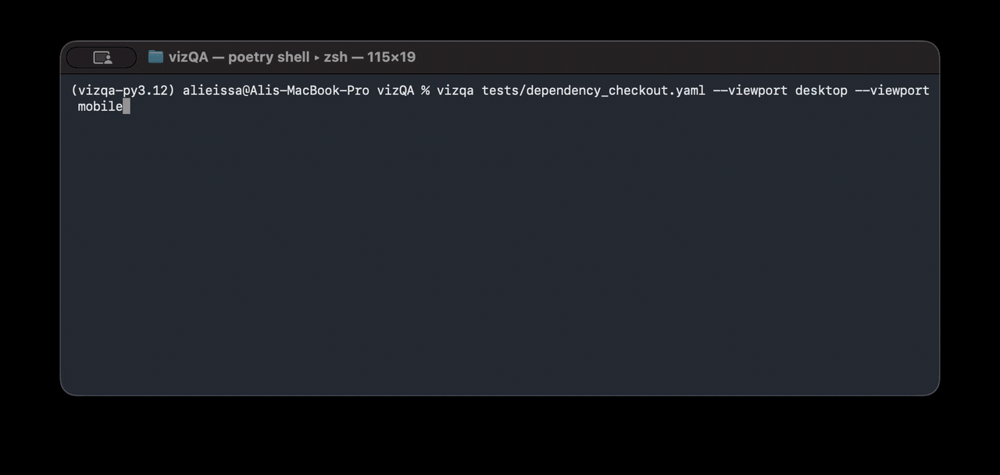
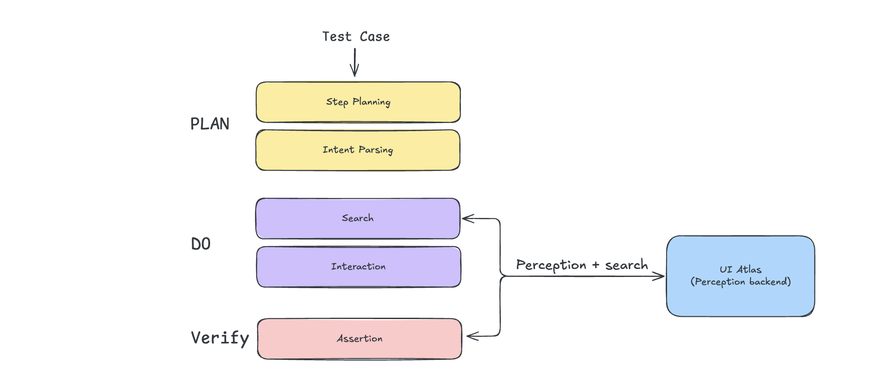

# vizQA: Vision-Driven Web UI Testing Framework

[](https://www.python.org/downloads/)
[](https://opensource.org/licenses/MIT)
[]()
[]()

**vizQA** is a UI testing framework that finds and interacts with visible elements through visual perception instead of CSS selectors or XPath. Tests are executed by deterministic, Playwright-based rules for repeatable regression—even when an LLM generates the test plan.

> [!NOTE]
> vizQA is currently in early alpha and still evolving as we work toward a more unified API. Expect some changes along the way, and feel free to share feedback as it develops.




---

## 👁️ Why Vision-Driven?

Modern UI automation has moved beyond brittle selectors and test-only frontend instrumentation. In many teams, the hard part is no longer writing assertions, but keeping locators, hooks, and page models aligned with a UI that changes constantly.

**vizQA treats the UI the way users experience it:**
- **More Powerful by Default**: Targets what is actually visible and interactable, not just what happens to exist in the DOM.
- **Flow-Oriented Testing**: Lets you describe user flows in plain language instead of maintaining large locator maps, page objects, or test-only abstractions.
- **Less Setup Overhead**: No need to add `data-testid` attributes everywhere or rely on an automation specialist to instrument every flow before it can be tested.
- **Better for Real Failures**: Helps catch issues involving hidden, off-screen, obstructed, overlapping, or otherwise non-visible elements that selector-based tests can miss.
- **Better Across Screen Sizes**: Useful for debugging and validating responsive behavior across different viewports, resolutions, and layout breakpoints.
- **Better for Debugging**: Makes it easier to understand what was actually rendered at the time of failure, especially with transient UI, overlays, and state that only appears in certain conditions.

## Flow design

---

## Key Features

- **Deterministic YAML v2**: Typed, schema-validated operations for stable CI and LLM-generated plans.
- **Natural-language YAML v1**: A supported format for existing suites and concise human-authored flows.
- **Perception-backed targets**: Refer to visible UI descriptions, not selectors or required `data-testid` attributes.
- **Interactions and assertions**: Click, type, scroll, drag, upload, wait, and verify visible state.
- **CI-ready**: Repeatable runs, multiple viewports, prerequisites, artifacts, and failure screenshots.
---

## 🚀 Getting Started

### Prerequisites

- **Python 3.11+**
- **Playwright**
- **UI Perception Backend**: vizQA requires a perception backend. You can run the official lightweight UI-Atlas docker image for fully local operation:
  ```bash
  docker run -d -p 8228:8000 --name ui-atlas tinyreasonlabs/ui-atlas:latest
  ```
  Learn more about [UI-Atlas on Dockerhub](https://hub.docker.com/r/tinyreasonlabs/ui-atlas)

  vizQA connects to the backend using the `PERCEPTION_BACKEND` environment variable (normalized to `http://…`; default `localhost:8228`, i.e. `http://localhost:8228`).
  - Examples:
    ```bash
    export PERCEPTION_BACKEND=localhost:8228   # bash / zsh
    ```

### Installation

```bash
pip install vizqa
vizqa install
```

`vizqa install` installs Playwright browser binaries and model weights under `vizQA/weights`, and refreshes the local weights metadata used by the CLI.

You can inspect both the package version and installed weights revision with:

```bash
vizqa --version
```

---

## 📝 Usage

For new tests, use deterministic YAML v2 (`schema: 2`). Each step is a typed,
schema-validated operation, so malformed LLM output fails before browser
execution. v2 uses the same perception-backed target resolution as the legacy
natural-language format, but does not use semantic parsing or a live LLM at
runtime. Existing v1 tests remain supported.

### Define a Test (`login_test.yaml`)

```yaml
schema: 2
name: "User Login Flow"
url: "https://example.com/login"

steps:
  - type: {target: "username field", text: "admin"}
  - type: {target: "password field", text: "password123"}
  - click: {target: "Login button"}
  - assert_visible: {target: "dashboard"}
```

YAML string values support environment-variable interpolation with `${VAR}`. If a referenced variable is not set, vizQA raises a test-definition error when loading the file.

For the full YAML format, legacy compatibility, and editor autocomplete, see
[docs/test_cases.md](docs/test_cases.md) and
[schemas/vizqa-test.schema.json](schemas/vizqa-test.schema.json).

### Run the Test

```bash
# Run all YAML tests in a directory (recursively; .yaml / .yml)
vizqa tests/

# Equivalent explicit subcommand
vizqa run tests/
```

### Use As a Library

You can also embed `vizQA` inside an existing Playwright test and mix DOM-based
and visual steps. The library now exposes two additive levels:

- high-level step execution with `click`, `type`, `verify`, and `run_step`
- low-level perception/search via `vizQA.search` when another tool needs
  coordinates and structured UI metadata without triggering an interaction

Recommended imports:

```python
from vizQA import attach, click, run_step, run_steps, type, verify
from vizQA.search import ElementMatch, SearchResult, search
```

High-level example:

```python
from vizQA import attach


async def test_login(page):
    vizqa = attach(page)

    await page.get_by_label("Email").fill("analyst.user@example.com")
    await page.get_by_label("Password").fill("AnalystPass!23")
    await vizqa.click("Sign in button")
    await vizqa.verify("Overview dashboard")
```

Low-level search example:

```python
from vizQA import attach
from vizQA.search import search


async def inspect_login(page):
    vizqa = attach(page)
    result = await vizqa.search("sign in button")

    if result.best_match:
        print(result.best_match.label)
        print(result.best_match.center)
        print(result.best_match.location)
```

Library usage is artifact-light by default. If you want persistent screenshots for debugging, pass `debug_dir=...` when attaching.

For the full library guide, see [docs/library_api.md](docs/library_api.md).

### CLI Arguments

| Argument | Description | Default |
| --- | --- | --- |
| `paths` | One or more paths to test files or directories. | Required for a run (omit to print help). |
| `--headless / --no-headless` | Run browser in headless mode. | `True` |
| `-s, --silent` | Use the compact terminal reporter instead of the default rich live view. | `False` |
| `--debug-log` | Keep the same terminal UI, but write richer DEBUG diagnostics to `.vizQA/run_*.log`. | `False` |
| `-x, --interactive` | Run in interactive mode; stop at the first failing test. | `False` |
| `--viewport` | Repeatable built-in viewport name (`mobile`, `tablet`, `desktop`, `widescreen`), custom configured profile name, or raw `WIDTHxHEIGHT` size such as `390x844`. Specify it multiple times to run several sizes in parallel. | Configured default viewports, otherwise `desktop` |

The default CLI output is now the verbose terminal reporter. Use `--silent` when you want a compact summary-oriented view. `--debug-log` only affects the `.vizQA` log files; it does not change the terminal layout.

If you do not define your own viewport profiles, vizQA includes these built-in sizes:
- `mobile`: `390x844`
- `tablet`: `768x1024`
- `desktop`: `1440x900`
- `widescreen`: `1728x1117`

---

## Configuration

vizQA supports global and per-test configuration, including custom HTTP headers for authentication or specialized testing.

For the broader configuration reference, including environment variables see [docs/configuration.md](docs/configuration.md).

### Global Configuration
You can define global headers and reusable viewport profiles in your `pyproject.toml` or a `.ini` file in the current working directory: `pytest.ini`, `tox.ini`, `setup.cfg`, or `vizqa.ini`.

**`pyproject.toml`**
```toml
[tool.vizqa.headers]
Authorization = "Bearer global-api-token"
X-Custom-Header = "GlobalValue"

[tool.vizqa.viewports]
app = "1280x720"
mobile = "390x844"
```

**`pytest.ini` / `tox.ini` / `setup.cfg` / `vizqa.ini`**
```ini
[vizqa.headers]
Authorization = Bearer global-api-token
X-Custom-Header = GlobalValue

[vizqa.viewports]
app = 1280x720
mobile = 390x844
```

Built-in viewport profile names:
- `mobile`
- `tablet`
- `desktop`
- `widescreen`

If you define viewport profiles for your app, `vizqa run ...` uses them by default when `--viewport` is omitted.

### Per-Test Overrides
You can specify or override headers directly in your test YAML file. These take precedence over global settings.

**`my_test.yaml`**
```yaml
name: "Protected API Test"
url: "https://example.com/api"
headers:
  Authorization: "Bearer test-specific-token"
steps:
  - action: "Open the dashboard"
    expect: "A welcome message should appear"
```

---

## Methodology

vizQA shares perception and browser execution across both formats:

1. **Perception** identifies visible elements and their properties.
2. **Planning** validates v2 operations or parses v1 natural-language steps.
3. **Execution** performs the action with Playwright and records evidence.

An LLM can provide the intent or generate v2 YAML; vizQA owns validation and browser execution.

---

## Contributing

We welcome contributions! Please see our [CONTRIBUTING.md](CONTRIBUTING.md) for details on setting up the environment and submitting PRs.

## License

This project is licensed under the MIT License - see the [LICENSE](LICENSE) file for details.
